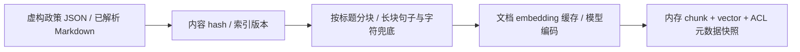
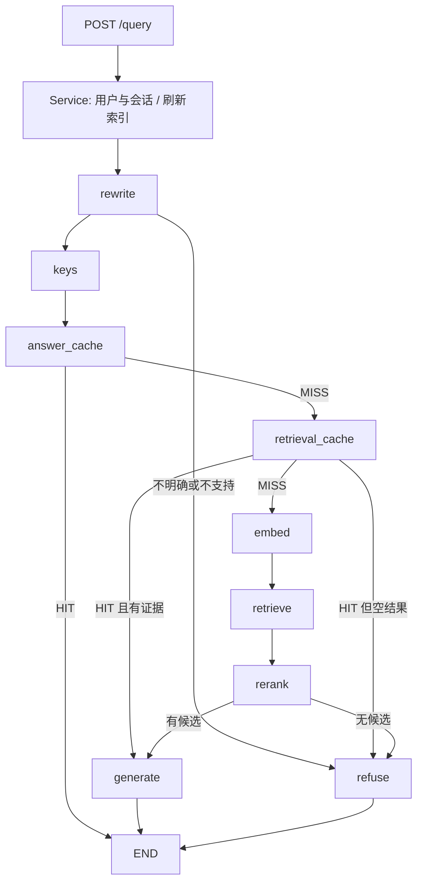
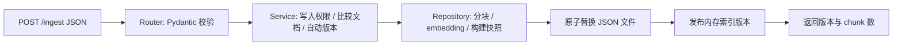

# 原型实际数据流程

## 入库：启动时与每次请求前检查变更

## 在线：图中的节点名与代码一致

`embed` 节点内部先查向量缓存；`retrieve` 节点内部先做 ACL/地区/有效期过滤。
重排结果写检索缓存，生成结果写答案缓存，Service 最后保存结构化会话状态。
本图没有把未实现的 SharePoint/OCR/SSO/Vector DB 画成已经存在的模块。

## 新增：HTTP 入库路径

GET /health 经 Router 调用 Service，读取已加载索引统计，不调用外部模型。
